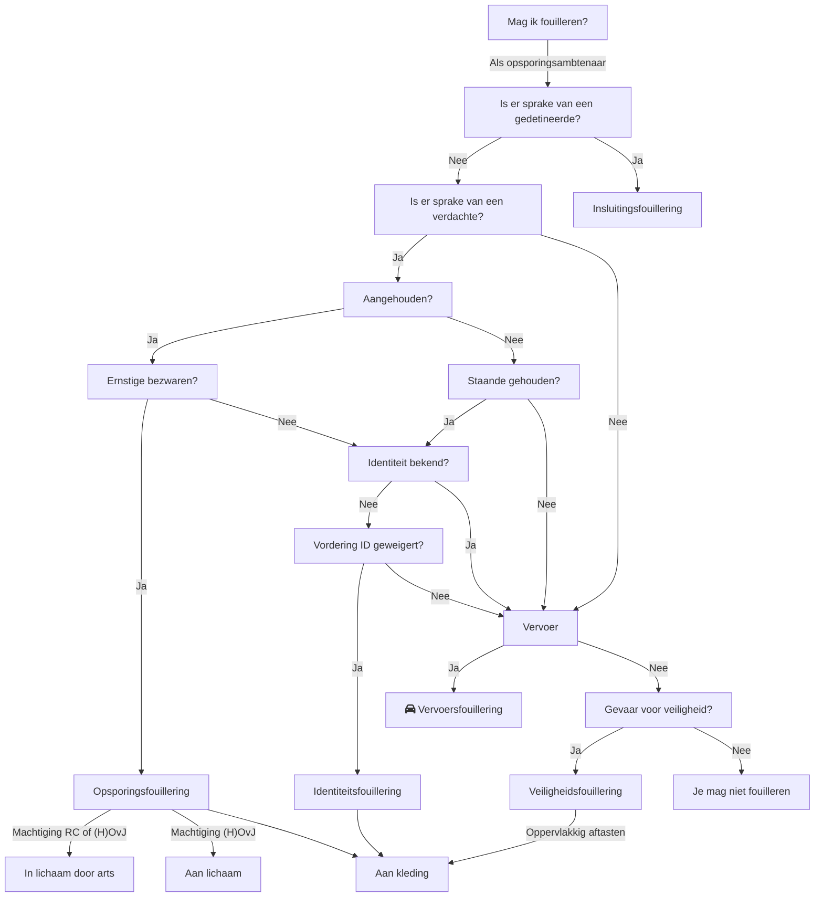

# My Mermaid Flowchart

```mermaid
flowchart TD
    A[Mag ik fouilleren?] -->|Als opsporingsambtenaar| AA[Is er sprake van een gedetineerde?]
    AA --> |Nee| B[Is er sprake van een verdachte?]
    AA --> |Ja| DBA[Insluitingsfouillering]
    B -->|Ja| C[Aangehouden?]
    B -->|Nee| D[Vervoer]
    D -->|Ja| DB[fa:fa-car Vervoersfouillering]
    D -->|Nee| DA[Gevaar voor veiligheid?]
    DA-->|Ja| DAA[Veiligheidsfouillering]
    DAA-->|Oppervlakkig aftasten| EAA
    DA -->|Nee| DAB[Je mag niet fouilleren]
    C -->|Ja| E[Ernstige bezwaren?]
    E -->|Ja| EA[Opsporingsfouillering]
    EA -->|"Machtiging RC of (H)OvJ"|EAC[In lichaam door arts]
    EA -->|"Machtiging (H)OvJ"|EAB[Aan lichaam]
    EA -->EAA[Aan kleding]
    E -->|Nee| FA
    C -->|Nee| F[Staande gehouden?]
    F -->|Ja| FA[Identiteit bekend?]
    FA -->|Nee| FAA[Vordering ID geweigert?]
    FAA -->|Ja| FAAA[Identiteitsfouillering]
    FAAA --> EAA
    FAA -->|Nee| D
    FA -->|Ja| D
    F -->|Nee| D
```
